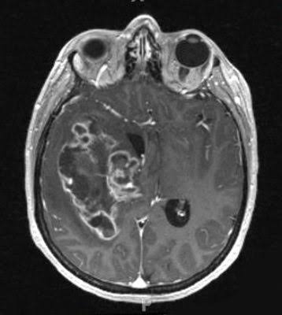

# Brain-Tumor-Detection
Deep learning project for detecting brain tumors from MRI images using Convolutional Neural Networks (CNN).
# 🧠 Brain Tumor Detection using CNN

## Project Overview

This project implements a Convolutional Neural Network (CNN) to classify brain MRI images and detect the presence of brain tumors. It demonstrates the complete deep learning workflow, including image preprocessing, model development, training, and prediction using TensorFlow and Keras.

---

## Sample MRI Image

---

## Features

- Brain MRI Image Classification
- Image Preprocessing
- CNN-based Deep Learning Model
- Brain Tumor Prediction
- Medical Image Analysis

---

## Technologies Used

- Python
- TensorFlow
- Keras
- OpenCV
- NumPy
- Matplotlib

---

## Skills Demonstrated

- Deep Learning
- Convolutional Neural Networks (CNN)
- Medical Image Classification
- Image Preprocessing
- Computer Vision
- TensorFlow & Keras

---

## Repository Contents

- `Brain_Tumor.ipynb` – Deep learning notebook
- `sample_mri.jpeg` – Sample MRI image used for demonstration

---

## Future Improvements

- Add trained model (`.h5` / `.keras`)
- Add prediction screenshots
- Add accuracy and loss graphs
- Deploy as a web application

---

## Author

**Vidhya Rabi**

Aspiring Data Analyst | Machine Learning & AI Enthusiast

**Skills:** Python • SQL • Power BI • Machine Learning • Deep Learning
